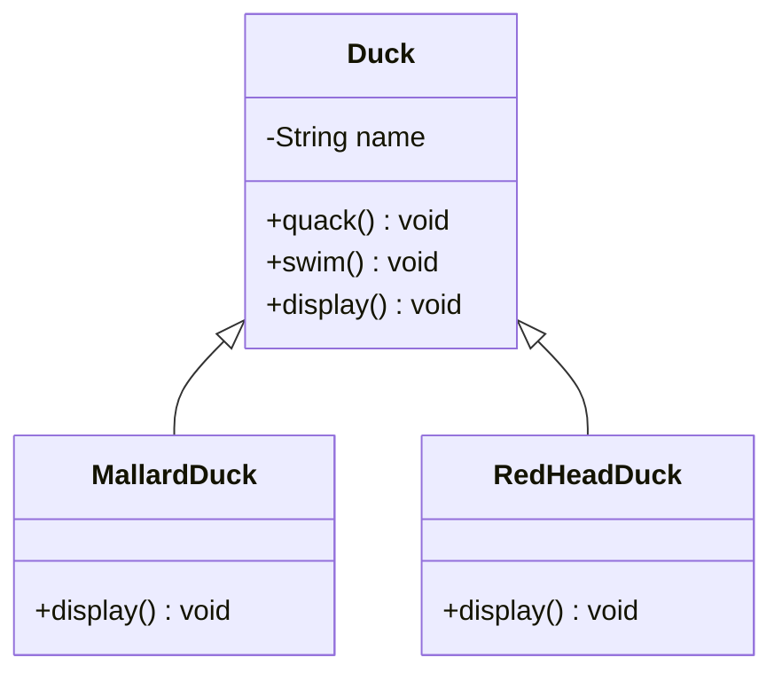

# Design Duck Pond Simulator

from HeadFirstDesign

## Problem Statement

You are developing an Duck Simulator which supports different kind of ducks such as MallardDuck, RedHeadDuck etc etc.

## First Thought Design



### Java Code

```java
public class Duck {
    private String name;

    public void quack(){};

    public void swim(){};

    public void display(){};
}

public class MallardDuck extends Duck {
    @Override
    public void display() {
        System.out.println("Looks like MallardDuck");
    }
}

public class RedHeadDuck extends Duck {
    @Override
    public void display() {
        System.out.println("Looks like RedHeadDuck");
    }
}

```

Now it was asked to have fly behavior to the ducks.

So suppose we have added fly() method in the superClass directly. By adding fly() method to superClass means we are giving flying Behavior to each and every type of Duck irrespective of that duck can actually fly or not.

### Problems with above Design
* Assuming all the kind of duck will fly, which will not be the case.
* So whichever Duck are not able to fly those also having fly implementation.

